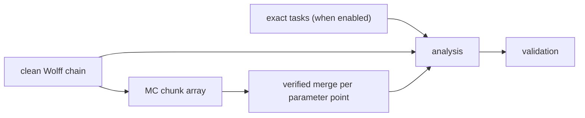

# DCFT simulation

This directory is the maintained simulation program for the decohered critical
Ising inference problem. The numerical contract is
`../notes/archive/all-to-all-approximation/section/simulation.tex`; the TNMC
reference is `../local/tensor-network-monte-carlo/arXiv-2409.06538v2/main.tex`.
Code under `archive/` is reference-only.

The program is one Rust/Python package and one `dcft` command. Local and Slurm
execution use the same planner and kernels. A cluster run uses the configured
checkout and its `.venv` directly: it does not copy source, create a runtime per
campaign, load modules, or make anything read-only.

## Install and test

```bash
uv sync --frozen
cargo fmt --all -- --check
cargo clippy --all-targets --all-features -- -D warnings
cargo test --all-targets
uv run ruff check python tests
uv run mypy python/dcft
uv run pytest
```

`rust-toolchain.toml`, `.python-version`, `Cargo.lock`, and `uv.lock` pin the
development environment. After editing Rust code, `uv sync` or `maturin
develop --release` rebuilds the extension.

## Common commands

```text
dcft campaign plan     --config CONFIG
dcft campaign run      --config CONFIG [--workers N] [--task-id ID]
dcft campaign analyze  --config CONFIG
dcft campaign validate --config CONFIG

dcft benchmark updates --config CONFIG [benchmark options]

dcft cluster doctor --config CONFIG
dcft cluster render --config CONFIG
dcft cluster submit --config CONFIG
dcft cluster status JOB_ID
dcft cluster resume --config CONFIG

dcft inspect PATH
```

For a complete local smoke run:

```bash
dcft campaign plan --config configs/local-smoke.toml
dcft campaign run --config configs/local-smoke.toml
dcft campaign analyze --config configs/local-smoke.toml
dcft campaign validate --config configs/local-smoke.toml
```

`campaign run` defaults to `[execution].local_workers`; `--workers` overrides
it. Random streams depend on the scientific key and global outer ID, never on
the worker, chunk, process, or Slurm task, so changing parallel shape does not
change the results.

## Parallel execution

The clean stage is one ordered Wolff chain per lattice size. Every fixed-record
parameter point is divided into `[execution].mc_chunks` balanced global-ID
ranges. A local or Slurm task handles one range, and a Rayon pool processes the
independent posterior chains in that range using:

- `[execution].local_workers` for ordinary local runs;
- `--workers N` when supplied explicitly;
- `[cluster].cpus_per_task` in generated Slurm scripts.

Each chunk writes an `mc-chunk` artifact. A deterministic merge task checks
that production global IDs are complete, non-overlapping, and ordered before
writing the `mc-records` artifact consumed by analysis.



Increasing chunks exposes more Slurm-level parallelism. Increasing workers
uses more cores inside each task. The two controls are operational and are not
part of the scientific configuration digest. There is no program-imposed
aggregate CPU ceiling. Choose the chunk count before planning; changing it
changes task boundaries and therefore requires a new output root. Worker and
Slurm resource settings can be adjusted without replanning.

## Update-method benchmarks

Use a representative lattice and record before choosing an update method or
cluster shape:

```bash
dcft benchmark updates \
  --config configs/update-benchmark.toml \
  --workers 8 \
  --speed-sweeps 256 \
  --probes 512 \
  --thermalization-sweeps 128 \
  --thermalization-measurements 128 \
  --chains 8 \
  --output artifacts/update-benchmark/local.json
```

The JSON report contains, for every configured update method:

- pure update sweep rate;
- Geyer integrated autocorrelation times for energy and planted overlap;
- effective planted-overlap samples per wall second;
- split R-hat after the requested thermalization budget, using overdispersed
  all-plus, all-minus, and random starts;
- serial-versus-Rayon throughput and speedup for those independent chains;
- Metropolis, corrected-Wolff, global, or TNMC acceptance statistics and TNMC
  positivity-regularization counts.

Timing is machine-specific. Repeat the benchmark for the lattice sizes,
disorder strengths, noise types, and TNMC bond dimensions relevant to the
production request. Do not select an update by sweep rate alone; the useful
quantity is effective independent samples per wall time with acceptable R-hat
and numerical diagnostics.

## Cluster use

Prepare the checkout once on the cluster:

```bash
cd /path/to/simulation
uv sync --frozen
dcft cluster doctor --config /path/to/campaign.toml
```

Then plan, inspect, and submit:

```bash
dcft campaign plan --config /path/to/campaign.toml
dcft cluster render --config /path/to/campaign.toml
dcft cluster submit --config /path/to/campaign.toml
```

The rendered scripts call `/path/to/simulation/.venv/bin/dcft` in place and
export `RAYON_NUM_THREADS=$SLURM_CPUS_PER_TASK`. The program does not impose an
array-concurrency or aggregate-CPU cap; Slurm and the account policy schedule
the requested work. `[cluster].memory` means memory per task, not memory per
CPU.

Do not edit the checkout while its jobs are running. This is a normal
operational rule rather than a deployment mechanism: artifacts record their
source digest, and analysis refuses to mix artifacts from different source
versions. If code changes, rebuild the checkout and use a new campaign output
root or rerun the stale tasks.

## Configuration

The maintained starting points are:

- `configs/local-smoke.toml`: small end-to-end development run;
- `configs/update-benchmark.toml`: all update methods on one representative
  point;
- `configs/comparison.toml`: MC/ED comparison matrix;
- `configs/scaling.toml`: large MC-only matrix;
- `configs/acceptance.toml`: bounded scientific acceptance matrix;
- `configs/mc-only-smoke.toml`: beyond-ED MC smoke path.

Scientific tables define the lattice, protocols, MC/ED budgets, and statistics.
`[execution]` and `[cluster]` define only how that work is divided and scheduled.
Use a new `campaign.name` and `output_root` for a new scientific request.

## Numerical implementation

Rust provides periodic lattices, clean Wolff generation, random and sequential
Metropolis, lazy global Metropolis, corrected Wolff, periodic TNMC, deterministic
keyed xoshiro256++ streams, and observable accumulation. TNMC freezes a random
row and column, contracts the remaining open rectangle with a truncated
boundary MPS, and applies the exact Hastings correction.

Python provides configuration and DAG planning, dense TFIM exact
diagonalization, finite-transfer and transfer-ground priors, Parquet artifacts,
Geyer autocorrelation estimates, moving-block resampling, I--MMSE integration,
analysis, plotting, validation, Slurm rendering, and update benchmarks.

Scientific results remain content-addressed Parquet artifacts with checksums,
parent links, source digests, complete parameter metadata, and deterministic
row ordering. `plan.json` and `state.json` are ordinary resumability records,
not scientific outputs.
